# FuelSight

FuelSight is a local-first full-stack ML/web system for fuel sales analysis,
procurement data, margin control, demand forecasting, and optional news/RAG
market context. The project is built as a diploma MVP and portfolio-grade demo:
it can be launched locally, seeded with synthetic business data, checked with
smoke tests, and shown without cloud dependencies.

FuelSight supports a role-based workflow close to a small fuel trading company.
Sales uploads and analyzes fuel realization data, accounting uploads procurement
data and controls cost/margin risks, analysts interpret sales, margin, forecasts
and market context, and the director receives an executive summary and prepares a
management report. The `admin` role remains a technical system administrator for
local demo preparation, diagnostics, seed data, and full local access.

## Business Problem

Small fuel businesses often combine `Excel + 1C + manual notes` for sales,
procurement, margin checks, demand planning, and market context. Responsibilities
are frequently mixed: the same person may upload sales, reconcile procurement
costs, interpret forecasts, and prepare management summaries.

FuelSight demonstrates a reproducible local workflow where each demo persona sees
the part of the process that matches their business responsibility. Sales works
with realization data, accounting controls procurement and gross margin, analysts
connect demand, anomalies and news/RAG context, and the director reviews KPI,
risks and the management report.

## Key Features

- Role-based authentication with five seeded demo personas.
- Sales and purchase import flows with role-aware access.
- Role-aware dashboard for sales, accounting, analyst, director, and admin views.
- Sales analytics with URL-synced filters, trends, seasonality, comparisons, and anomalies.
- Procurement and margin analytics with low-margin detection and business explanations.
- Demand forecast for `1`, `7`, and `30` days with price-delta scenarios.
- Forecast validation evidence: CatBoost vs Seasonal Naive, test-period chart, and `MAE`/`RMSE`/`SMAPE`.
- Executive report / `Управленческий отчет` for management review.
- Optional news digest, search, and retrieval-first RAG chat with citations.
- Offline-safe local demo runner, smoke checks, and portfolio screenshots.

## Users And Roles

| Role slug | Display name | Business meaning | Main responsibilities |
| --- | --- | --- | --- |
| `admin` | Системный администратор | Техническое сопровождение | demo data, диагностика, полный локальный доступ |
| `sales` | Отдел продаж | Работа с реализацией | импорт продаж, аналитика продаж, прогноз спроса |
| `accounting` | Бухгалтерия | Финансовый контроль | импорт закупок, себестоимость, маржа, низкомаржинальные позиции |
| `analyst` | Аналитический отдел | Комплексная аналитика | продажи, маржа, прогнозы, новости/RAG, отчеты |
| `director` | Генеральный директор | Управленческий контроль | KPI, риски, forecast summary, управленческий отчет |

The technical slug `admin` is intentionally kept. Documentation may describe it
as `Системный администратор`, but code, seed data, permissions and API payloads
use `admin`.

## Main Business Scenario

1. `admin` starts the local demo stack, applies migrations, seeds users/products,
   and generates demo history.
2. `sales` signs in, uploads sales data, and checks realization dynamics.
3. `accounting` uploads purchase data and reviews cost, margin, and low-margin positions.
4. `analyst` analyzes sales, margin, forecasts, anomalies, and news/RAG market context.
5. `director` opens the executive dashboard, reviews KPI/risks, and generates the Management report.

## Role-based Demo Scenario

- Login as `admin`: show technical system overview, import pages, initial history
  generation, import history, diagnostics, and local demo readiness. Business value:
  the demo can be prepared reproducibly before the defense. This role sees all major
  sections and is not the ordinary business owner of sales/procurement data.
- Login as `sales`: show sales dashboard, sales import, sales analytics, and demand
  forecast. Business value: the sales department owns realization data and demand
  dynamics. This role does not see purchase import, admin diagnostics, news/RAG UI,
  or the executive report route.
- Login as `accounting`: show purchase import, financial overview, margin analytics,
  and low-margin checks. Business value: accounting controls procurement cost and
  gross margin. This role does not see sales import, admin diagnostics, or the
  executive report route.
- Login as `analyst`: show sales analytics, margin analytics, forecast, news/RAG
  context, and reports. Business value: the analyst explains demand, margin and
  market factors without owning data uploads. This role does not see import pages.
- Login as `director`: show `/executive/dashboard`, KPI, margin risks, forecast
  summary, news summary, and `/reports/executive`. Business value: the director
  receives a management summary and can form the final report. This role does not
  see import pages or admin tools; backend RAG chat actions are not permitted for
  this role.

## Architecture Overview

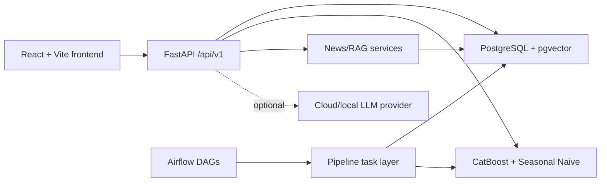

The non-LLM MVP path works with `ENABLE_LLM=false`. Cloud-enhanced mode only runs
when explicitly configured and should be treated as a deliberate demo mode, not
the default.

## Tech Stack

- Frontend: `React`, `Vite`, `TypeScript`, `MUI`, `Apache ECharts`, `React Router`, `TanStack Query`
- Backend: `FastAPI`, `Pydantic v2`, `SQLAlchemy 2.0`, `Alembic`, `PostgreSQL`
- Pipelines: `Airflow`
- ML: `CatBoost` primary model, `Seasonal Naive` baseline
- Infrastructure: `Docker Compose`, `pgvector/PostgreSQL`, local env files
- Optional NLP/LLM: news digest, retrieval-first chat, citations, provider-neutral LLM adapters

## What This Project Demonstrates

- Full-stack ML application architecture with a typed FastAPI API and React/Vite/TypeScript UI.
- PostgreSQL persistence through SQLAlchemy models, Alembic migrations, and pgvector-backed RAG storage.
- Docker Compose local deployment for the core app and optional Airflow orchestration.
- Role boundaries across backend endpoints, frontend navigation, dashboards, imports, and reports.
- CatBoost-based demand forecasting with Seasonal Naive baseline comparison and backtest metrics.
- Analytical dashboards for KPI, sales trends, margin risk, anomalies, and forecast quality.
- Retrieval-first news/chat context that works in offline-safe mode without cloud LLM keys.
- Production-like validation: backend lint/tests, frontend tests/build, mocked e2e,
  backend-backed browser smoke, and full demo smoke.

## Screenshots

Desktop portfolio screenshots are generated from the real backend-backed demo
stack, not mocked API responses. The portfolio capture uses a desktop viewport
(`1440x1000`, device scale factor `1`).

### Login

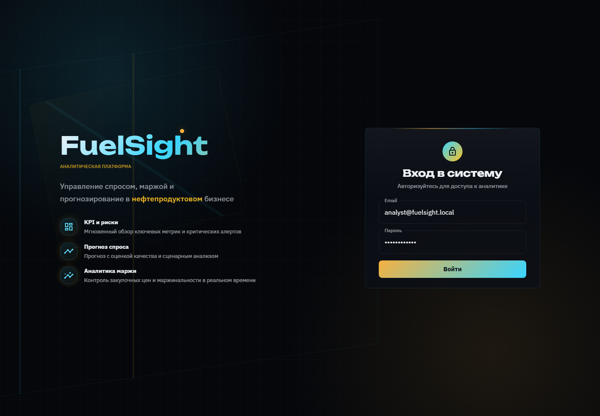

### Role-aware dashboards

#### Admin

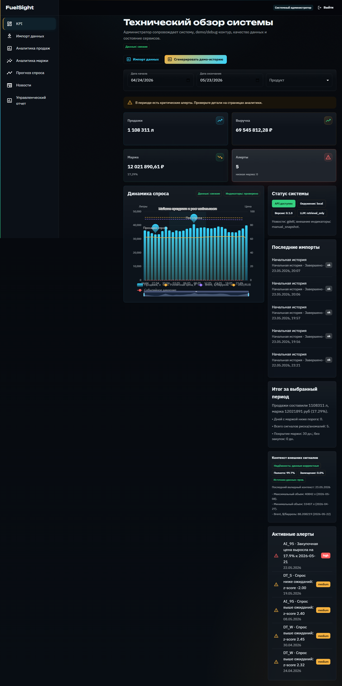

#### Sales

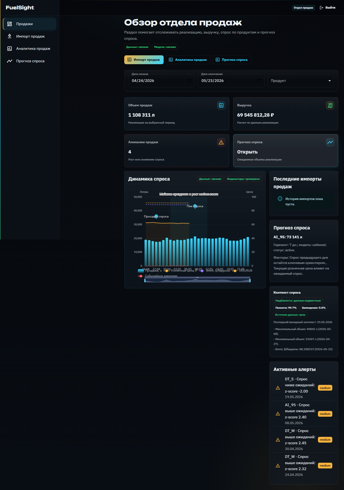

#### Accounting

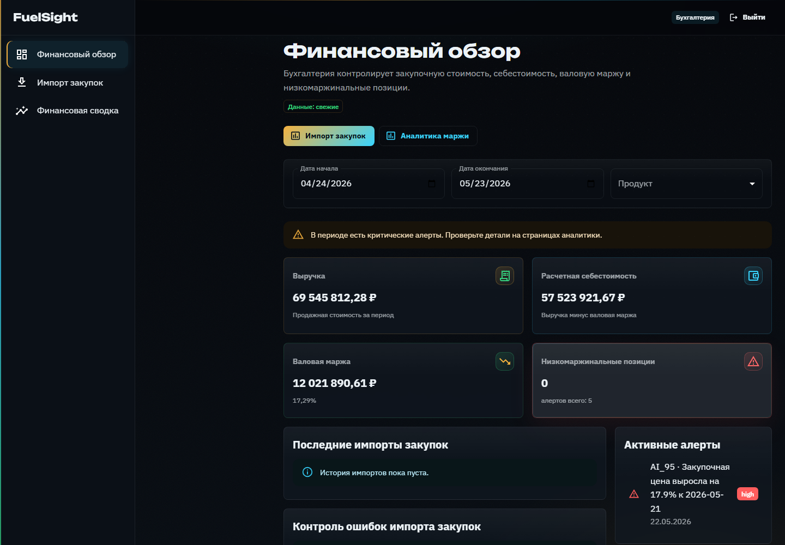

#### Analyst

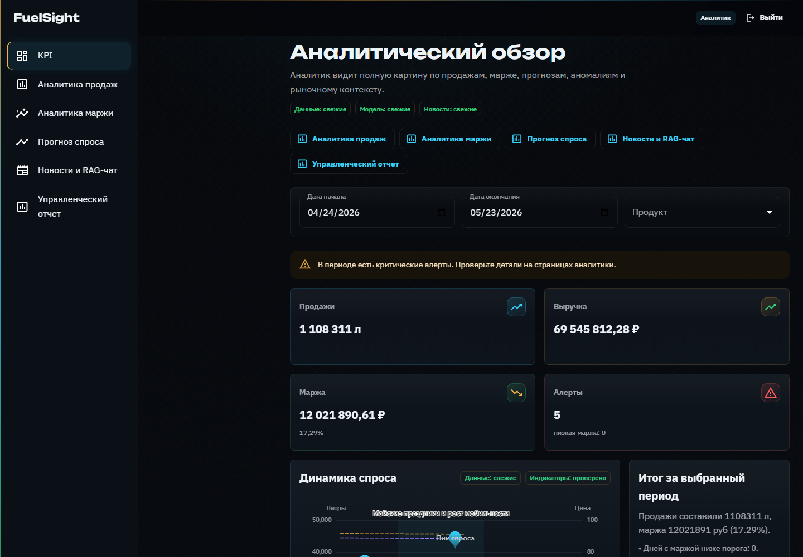

#### Director

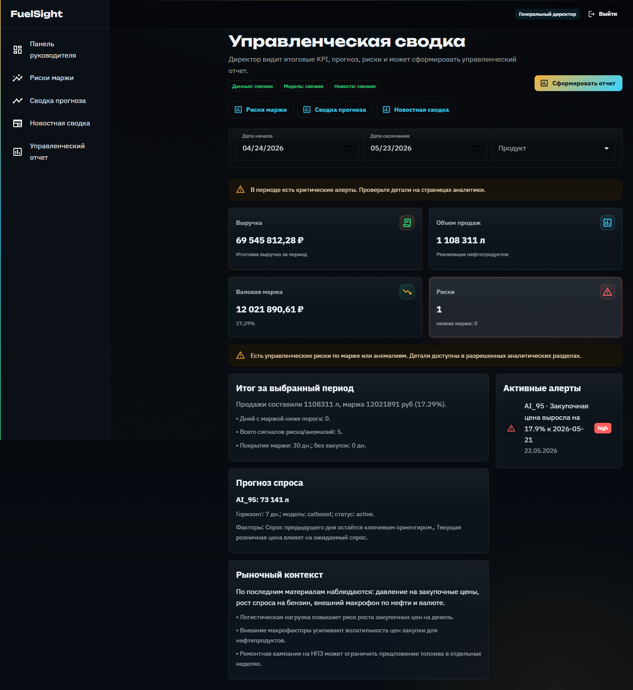

### Business workflows

#### Sales Import

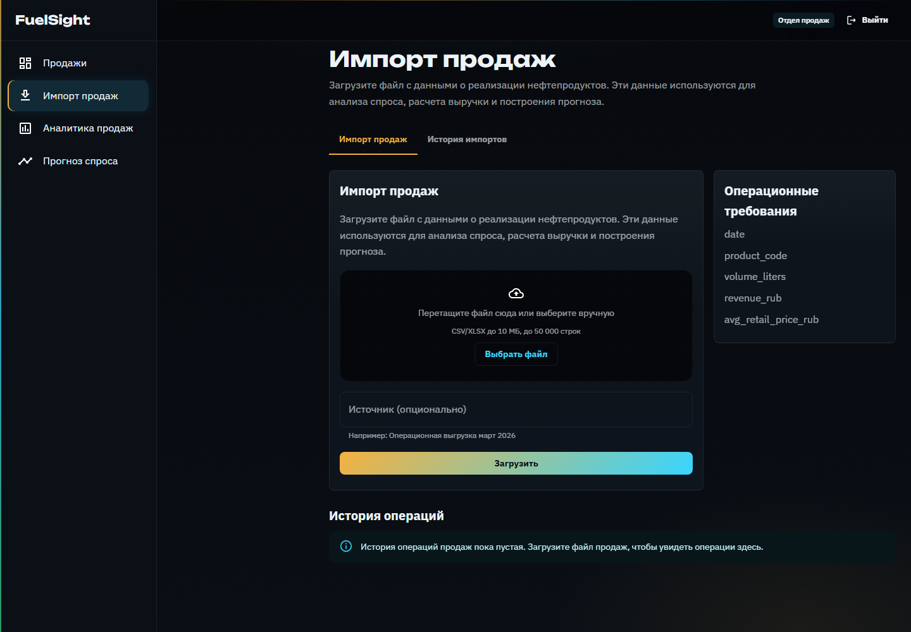

#### Purchase Import

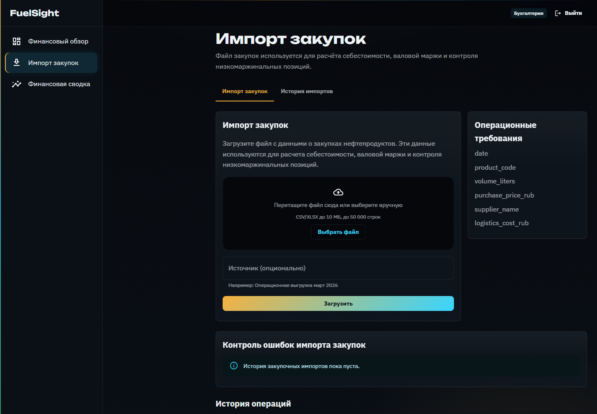

#### Sales Analytics

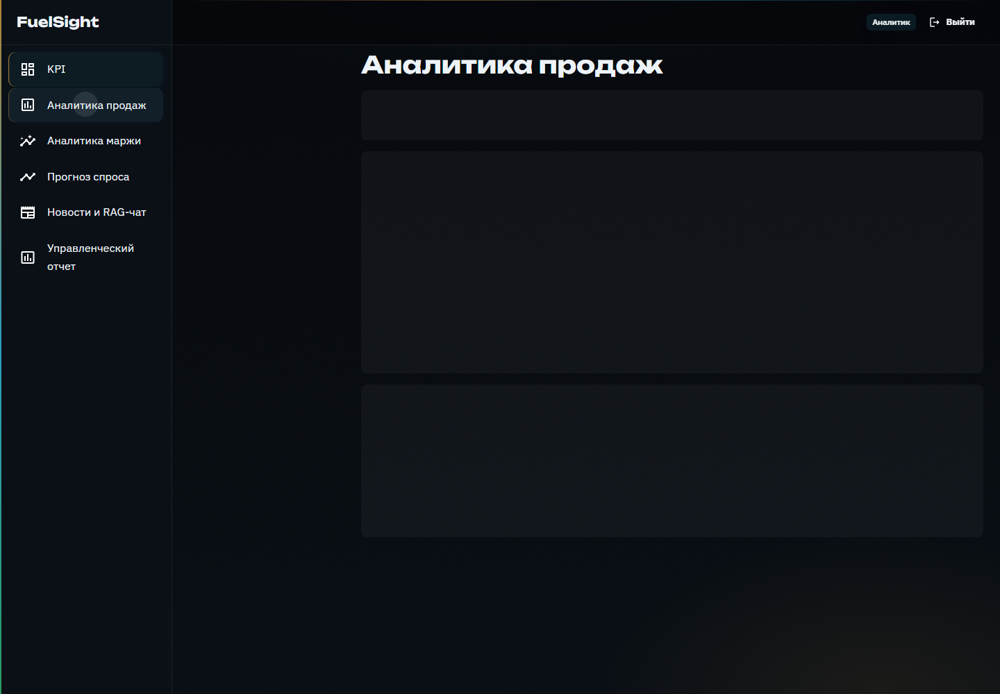

#### Margin Analytics

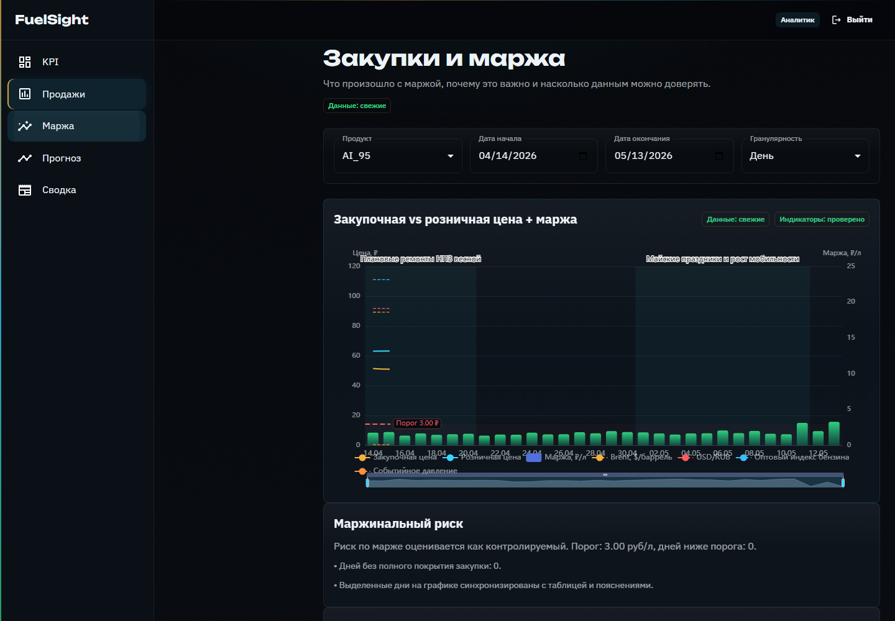

#### Forecast

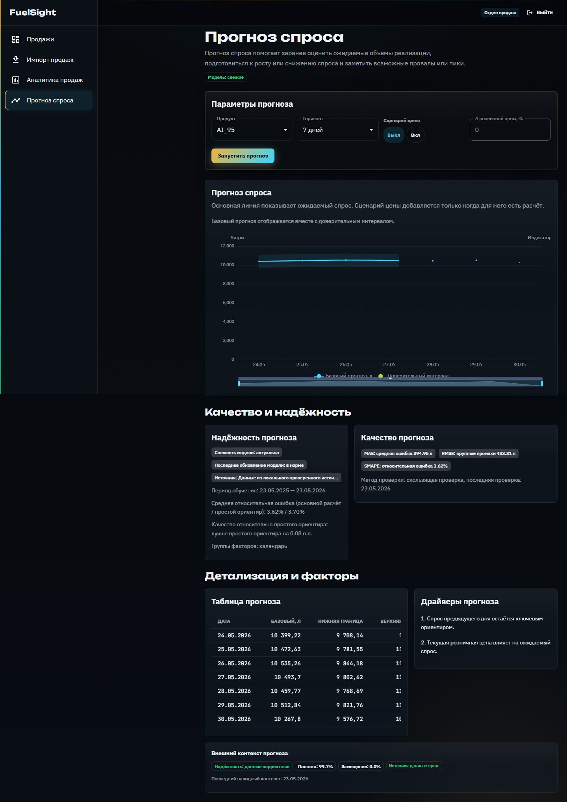

#### News/RAG

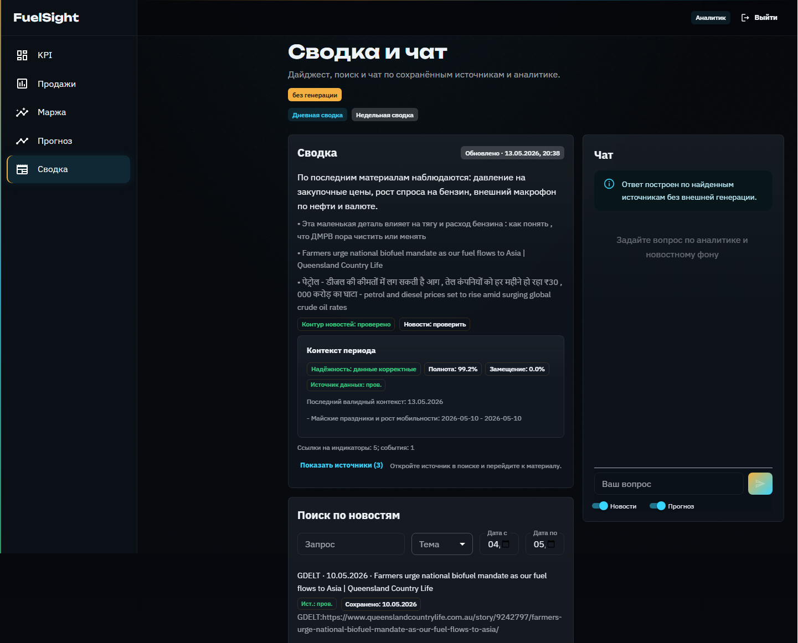

#### Executive Report

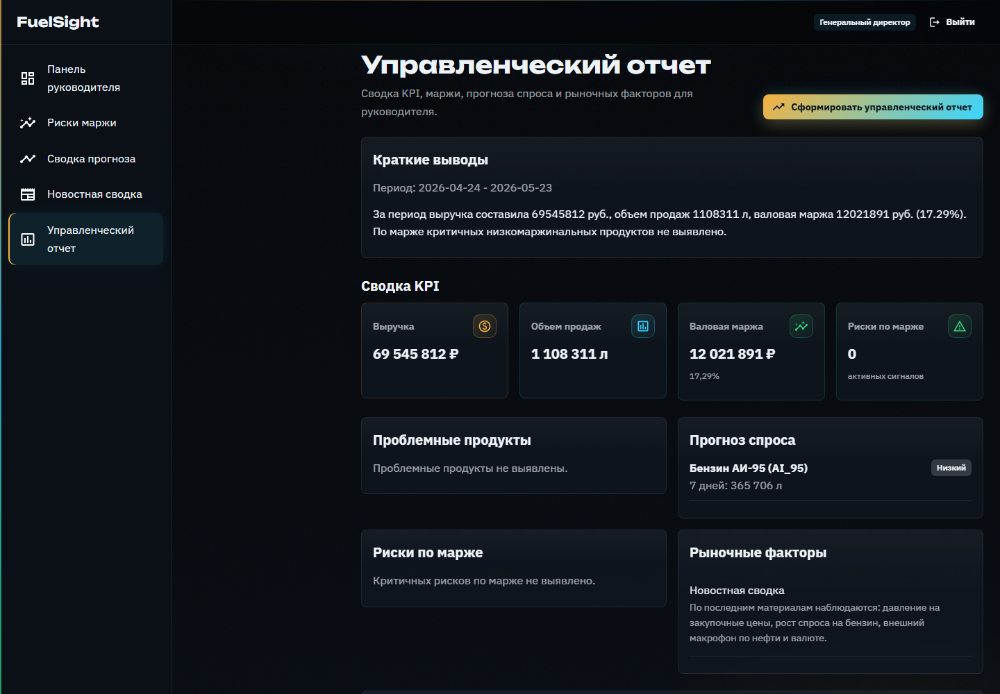

Regenerate them after starting and seeding the demo stack:

```bash
python scripts/run_full_demo.py --without-airflow --with-portfolio-screenshots
```

## Quick Start

Prerequisites:

- Docker Desktop with Docker Compose.
- Python available as `python` for demo scripts.
- Node/Corepack only if you run frontend commands outside Docker.
- `uv` only if you run backend commands outside Docker.

Prepare local env files:

```powershell
Copy-Item .env.example .env
Copy-Item compose/env/db.env.example compose/env/db.env
Copy-Item compose/env/backend.env.example compose/env/backend.env
Copy-Item compose/env/frontend.env.example compose/env/frontend.env
Copy-Item compose/env/airflow.env.example compose/env/airflow.env
```

```bash
cp .env.example .env
cp compose/env/db.env.example compose/env/db.env
cp compose/env/backend.env.example compose/env/backend.env
cp compose/env/frontend.env.example compose/env/frontend.env
cp compose/env/airflow.env.example compose/env/airflow.env
```

Start the deterministic offline-safe core stack:

```bash
docker compose -f compose/docker-compose.yml -f compose/docker-compose.offline-safe.yml --profile core up -d --build
```

For a public-safe local demo, bind published ports to `127.0.0.1`:

```bash
docker compose -f compose/docker-compose.yml -f compose/docker-compose.offline-safe.yml -f compose/docker-compose.localhost.yml --profile core up -d --build
```

The base compose command is convenient on a trusted development machine. The
`localhost` override is safer for public demos because PostgreSQL, backend,
frontend, and Airflow ports are only reachable from the local host.

Open:

- Frontend: `http://localhost:3000`
- Backend health: `http://localhost:8061/api/v1/health`

Core + Airflow:

```bash
docker compose -f compose/docker-compose.yml -f compose/docker-compose.offline-safe.yml --profile core --profile airflow up -d --build
```

Stop:

```bash
docker compose -f compose/docker-compose.yml -f compose/docker-compose.offline-safe.yml --profile core --profile airflow down
```

## Full Demo And Smoke Checks

Run the full offline-safe demo chain. It starts the stack, applies migrations,
seeds users, generates demo history, refreshes external context/news/RAG
artifacts, trains/backtests models, validates API contracts, and builds the
legacy technical defense artifact used by the demo runner:

```bash
python scripts/run_full_demo.py
```

Use an explicit profile when needed:

```bash
python scripts/run_full_demo.py --profile offline-safe
python scripts/run_full_demo.py --profile cloud-enhanced
```

Add mocked desktop Playwright e2e for fast frontend persona flows:

```bash
python scripts/run_full_demo.py --with-e2e
```

Add backend-backed browser smoke against the real running backend:

```bash
python scripts/run_full_demo.py --with-browser-smoke
```

Regenerate desktop portfolio screenshots from the real backend-backed demo:

```bash
python scripts/run_full_demo.py --without-airflow --with-portfolio-screenshots
```

Optional mobile e2e smoke artifacts:

```bash
python scripts/run_full_demo.py --with-mobile-e2e
```

Generated reports are local artifacts and are ignored by git:

- `scripts/last-smoke-result.json`
- `scripts/last-defense-report.json`

The UI-facing business report is `Управленческий отчет` at `/reports/executive`.
The pipeline command and artifact names still use `defense` as legacy internal
demo terminology.

## Demo Credentials

Local seeded users confirmed in `backend/app/scripts/seed_core.py`:

| Role | Email | Password | Purpose |
| --- | --- | --- | --- |
| `admin` | `admin@fuelsight.local` | `admin12345` | System administration, demo data, diagnostics |
| `sales` | `sales@fuelsight.local` | `sales12345` | Sales department demo persona |
| `accounting` | `accounting@fuelsight.local` | `accounting12345` | Accounting department demo persona |
| `analyst` | `analyst@fuelsight.local` | `analyst12345` | Analytics department demo persona |
| `director` | `director@fuelsight.local` | `director12345` | Executive dashboard / executive report demo persona |

These credentials are for local diploma/demo use only. Disable demo users and
frontend credential prefill before exposing the app outside a local machine:

- `FUELSIGHT_SEED_DEMO_USERS=false`
- `VITE_ENABLE_DEMO_CREDENTIALS=false`

## How To Check Role Access

Admin:

- sees all major sections;
- can import sales and purchases;
- can generate demo history and use diagnostics;
- can open `/reports/executive`.

Sales:

- sees sales dashboard, sales import, sales analytics, and forecast;
- does not see purchase import, admin diagnostics, `/news`, or `/reports/executive`.

Accounting:

- sees purchase import, purchase-filtered import history, financial dashboard, and margin analytics;
- does not see sales import, admin diagnostics, `/news`, or `/reports/executive`.

Analyst:

- sees sales analytics, margin analytics, forecast, news/RAG chat, and `/reports/executive`;
- does not see import pages or demo/admin tools.

Director:

- lands on `/executive/dashboard`;
- sees KPI, forecast summary, margin risks, news summary/context, and `/reports/executive`;
- does not see import pages or admin tools;
- backend RAG chat actions are restricted to `admin` and `analyst`.

## What To Demonstrate During Diploma Defense

- Reproducible local launch through Docker Compose and `scripts/run_full_demo.py`.
- Seeded demo users for all five roles.
- Role-based access in frontend navigation and backend API guards.
- Sales/procurement data flow: sales import, purchase import, import history.
- Margin control: gross margin, low-margin positions, and purchase-price risks.
- Demand forecast: horizons, scenario mode, model quality and baseline comparison.
- News/RAG context when enabled or offline-safe retrieval mode when cloud keys are absent.
- `Управленческий отчет` for director/analyst/admin roles.
- Build, tests, smoke checks, and generated local demo artifacts.

## Environment Variables

Important local files:

- `.env.example` -> copy to `.env`
- `backend/.env.example`
- `compose/env/*.env.example` -> copy to `compose/env/*.env`

Key variables:

- `APP_ENV`: `local`, `test`, or production-like environment name.
- `JWT_SECRET_KEY`: must be at least 32 characters outside `local`/`test`.
- `ENABLE_LLM`: set `false` for the core/offline-safe MVP.
- `LLM_PROVIDER_MODE`: `retrieval_only`, `local_only`, or `cloud_first`.
- `LLM_API_KEY`, `GIGACHAT_AUTH_KEY`: optional cloud credentials; leave empty for public/local demos.
- `IMPORT_MAX_UPLOAD_BYTES`, `IMPORT_MAX_ROWS`: upload guardrails, default `10 MiB` and `50000` rows.

Security notes:

- `.env` and `compose/env/*.env` are ignored by git and may contain local secrets.
- The default compose file publishes local ports on all interfaces; keep it on a trusted machine/network.
- `cloud-enhanced` mode can send evidence/citation packs to a configured provider.
  Use it only with approved credentials and data.
- No git history rewrite is required unless a real secret is later confirmed in committed history.

## Backend Commands

```bash
cd backend
uv sync
uv run alembic upgrade head
uv run fuelsight-seed-core
uv run pytest
uv run ruff check .
```

Pipeline examples:

```bash
uv run fuelsight-pipeline generate-demo-data --replace-existing
uv run fuelsight-pipeline ingest-external-indicators-daily --provider manual_snapshot
uv run fuelsight-pipeline build-feature-store-daily
uv run fuelsight-pipeline train-models-weekly --window-type rolling
uv run fuelsight-pipeline refresh-news-daily --provider manual_snapshot --lookback-days 30
uv run fuelsight-pipeline refresh-rag-index-daily
uv run fuelsight-pipeline build-defense-report --profile offline-safe
```

`build-defense-report` is the current technical command name. In the UI and
business documentation, the corresponding user-facing function is the
`Управленческий отчет`.

## Frontend Commands

```bash
corepack pnpm --filter frontend install
corepack pnpm --filter frontend dev --host 0.0.0.0 --port 3000
corepack pnpm --filter frontend test
corepack pnpm --filter frontend build
corepack pnpm --filter frontend test:e2e:desktop
corepack pnpm --filter frontend test:e2e:backend
corepack pnpm --filter frontend screenshots:portfolio
```

## Testing

Recommended local validation mirrors the GitHub Actions CI checks:

```bash
cd backend
uv run ruff check .
uv run pytest
uv tool run pip-audit
```

```bash
corepack pnpm --filter frontend test
corepack pnpm --filter frontend build
cd frontend
corepack pnpm audit --prod
cd ..
corepack pnpm --filter frontend test:e2e:desktop
```

Browser and demo validation layers:

```bash
python scripts/run_full_demo.py
python scripts/run_full_demo.py --with-e2e
python scripts/run_full_demo.py --with-browser-smoke
python scripts/run_full_demo.py --with-portfolio-screenshots
```

CI currently runs backend lint/tests and frontend tests/build. Full Docker demo,
backend-backed browser smoke, and screenshot generation are local validation
steps because they require the demo stack and seeded data.

## Project Structure

```text
backend/          FastAPI app, SQLAlchemy models, Alembic migrations, Airflow DAGs, ML modules
compose/          Docker Compose files and local env examples
docs/             Curated public project documentation
frontend/         React/Vite frontend and Playwright tests
scripts/          Demo runner and start/stop helpers
```

## Project Status

FuelSight is feature-complete for the diploma/portfolio scope. The default
public demo path is offline-safe: it uses synthetic local data, deterministic
pipeline steps, retrieval-only chat, and no cloud credentials.

## Final Validation

- GitHub Actions: backend `ruff` + `pytest`, frontend `test` + `build`.
- Local frontend e2e: mocked desktop analyst/admin persona flows.
- Local backend-backed browser smoke: real login, dashboard, forecast, and news/chat navigation.
- Full demo smoke: Docker Compose core stack, migrations, seeded demo users,
  generated history, external context/news/RAG refresh, model training/backtesting,
  API contract checks, and legacy technical demo report generation.

## Limitations

- `v1` supports one sales point; there is no `stations` entity.
- The project is local-first and not designed as a public multi-tenant SaaS.
- Demo data is synthetic but generated through the same import/pipeline path used by smoke checks.
- FuelSight is not a replacement for 1C, ERP, CRM, or a regulated accounting system.
- Mocked Playwright e2e validates frontend routing/UX quickly; backend-backed browser smoke validates the real API path.
- Cloud LLM calls depend on real provider credentials; the supported default is retrieval-only/offline-safe.

## Diploma And Portfolio Note

FuelSight is intentionally scoped as a local diploma MVP with production-like
engineering: typed API contracts, migrations, role boundaries, test coverage,
Airflow orchestration, ML backtesting, cited RAG/chat behavior, and reproducible
demo scripts.
