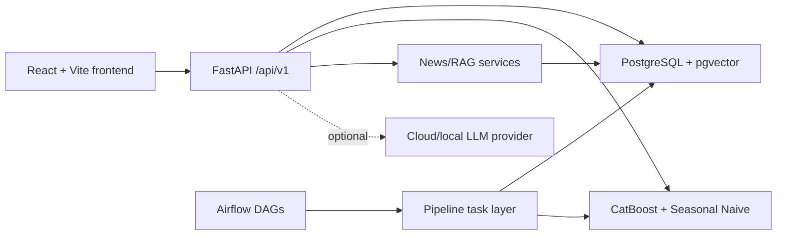
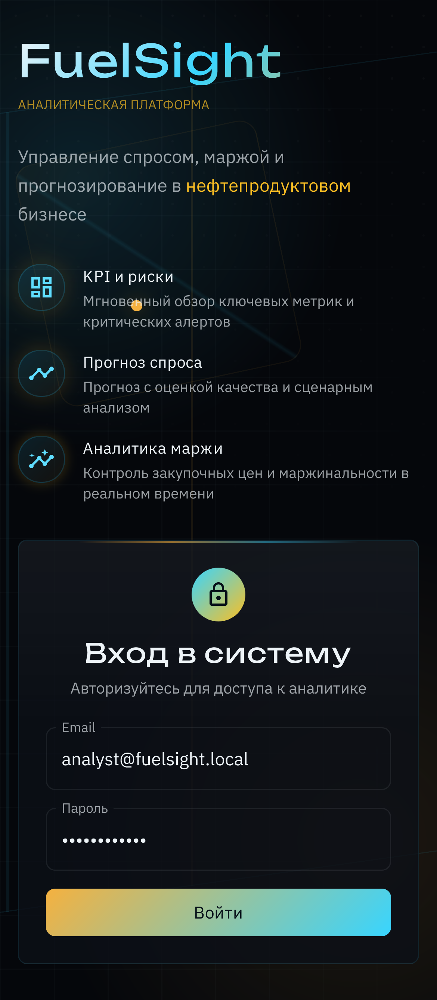
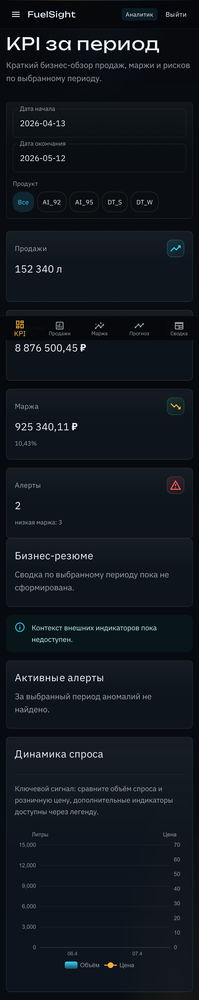
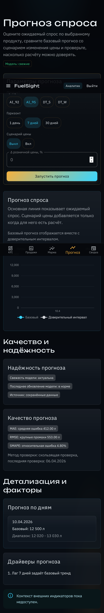
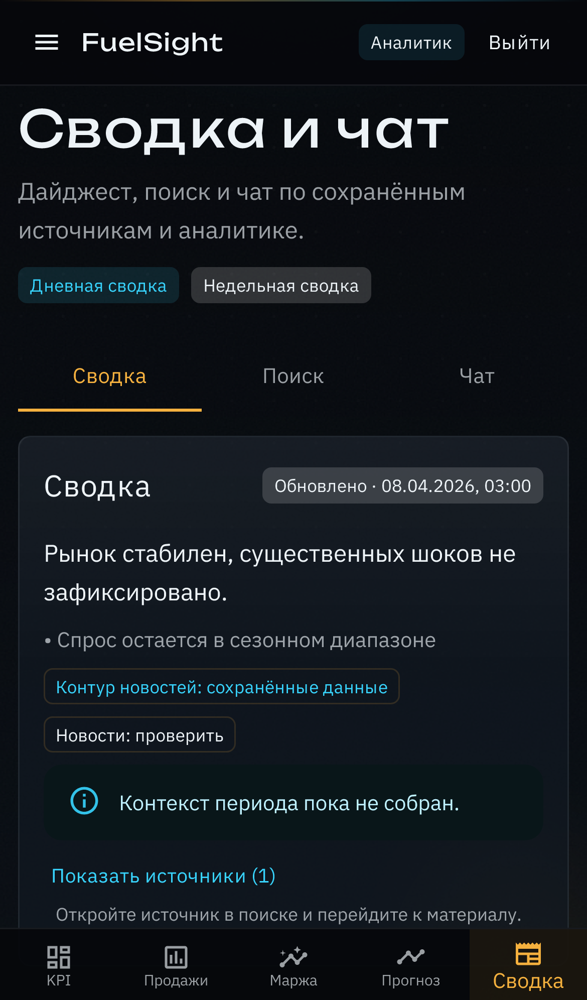

# FuelSight

FuelSight is a local web analytics system for fuel sales, procurement, margin control,
demand forecasting, and optional news/RAG chat. It was built as a diploma project and
portfolio-grade ML/web system: the demo can be started locally, seeded with realistic
data, checked with smoke tests, and shown without cloud dependencies.

## Business Problem

Small fuel businesses often combine `Excel + 1C + manual notes` for sales, purchasing,
margin checks, and demand planning. FuelSight turns that workflow into one reproducible
local dashboard: import or generate historical data, inspect KPI and margin risks,
run demand forecasts, and optionally explain market context through cited news and chat.

## Key Features

- Local auth flow with `admin` and `analyst` roles.
- Admin data import: CSV/XLSX upload and generated demo history.
- KPI dashboard with sales volume, revenue, gross margin, alerts, and empty states.
- Sales analytics with URL-synced filters, trends, seasonality, comparisons, and anomalies.
- Procurement and margin analytics with low-margin detection and business explanations.
- Demand forecast for `1`, `7`, and `30` days with price-delta scenarios.
- Forecast quality metrics: `MAE`, `RMSE`, `SMAPE`, plus CatBoost vs Seasonal Naive comparison.
- Optional news digest, search, and retrieval-first chat with citations.
- Offline-safe defense/demo runner that builds data, models, RAG index, smoke checks, and a defense report.

## Architecture Overview



The non-LLM MVP path works with `ENABLE_LLM=false`. Cloud-enhanced mode only runs when
explicitly configured and should be treated as a deliberate demo mode, not the default.

## Tech Stack

- Frontend: `React`, `Vite`, `TypeScript`, `MUI`, `Apache ECharts`, `React Router`, `TanStack Query`
- Backend: `FastAPI`, `Pydantic v2`, `SQLAlchemy 2.0`, `Alembic`, `PostgreSQL`
- Pipelines: `Airflow`
- ML: `CatBoost` primary model, `Seasonal Naive` baseline
- Infrastructure: `Docker Compose`, `pgvector/PostgreSQL`, local env files
- Optional NLP/LLM: news digest, retrieval-first chat, citations, provider-neutral LLM adapters

## Screenshots

Mobile smoke screenshots generated by Playwright:

| Login | Dashboard |
| --- | --- |
|  |  |

| Forecast | News and Chat |
| --- | --- |
|  |  |

## Quick Start

Prerequisites:

- Docker Desktop with Docker Compose.
- Python available as `python` for demo scripts.
- Node/Corepack only if you run frontend commands outside Docker.
- `uv` only if you run backend commands outside Docker.

Prepare local env files:

```powershell
Copy-Item .env.example .env
Copy-Item compose/env/db.env.example compose/env/db.env
Copy-Item compose/env/backend.env.example compose/env/backend.env
Copy-Item compose/env/frontend.env.example compose/env/frontend.env
Copy-Item compose/env/airflow.env.example compose/env/airflow.env
```

```bash
cp .env.example .env
cp compose/env/db.env.example compose/env/db.env
cp compose/env/backend.env.example compose/env/backend.env
cp compose/env/frontend.env.example compose/env/frontend.env
cp compose/env/airflow.env.example compose/env/airflow.env
```

Start the deterministic offline-safe core stack:

```bash
docker compose -f compose/docker-compose.yml -f compose/docker-compose.offline-safe.yml --profile core up -d --build
```

Open:

- Frontend: `http://localhost:3000`
- Backend health: `http://localhost:8061/api/v1/health`

Core + Airflow:

```bash
docker compose -f compose/docker-compose.yml -f compose/docker-compose.offline-safe.yml --profile core --profile airflow up -d --build
```

Stop:

```bash
docker compose -f compose/docker-compose.yml --profile core --profile airflow down
```

## Full Demo And Smoke Checks

Run the full offline-safe demo chain:

```bash
python scripts/run_full_demo.py
```

Run the same chain with desktop Playwright e2e:

```bash
python scripts/run_full_demo.py --with-e2e
```

Optional mobile e2e smoke:

```bash
python scripts/run_full_demo.py --with-mobile-e2e
```

Generated reports are local artifacts and are ignored by git:

- `scripts/last-smoke-result.json`
- `scripts/last-defense-report.json`

## Demo Credentials

Local seeded users:

| Role | Email | Password | Purpose |
| --- | --- | --- | --- |
| `admin` | `admin@fuelsight.local` | `admin12345` | Imports, demo data refresh, operational actions |
| `analyst` | `analyst@fuelsight.local` | `analyst12345` | Dashboard, analytics, forecast, news/chat |

These credentials are for local diploma/demo use only. Disable demo users and frontend
credential prefill before exposing the app outside a local machine:

- `FUELSIGHT_SEED_DEMO_USERS=false`
- `VITE_ENABLE_DEMO_CREDENTIALS=false`

## Environment Variables

Important local files:

- `.env.example` -> copy to `.env`
- `backend/.env.example`
- `compose/env/*.env.example` -> copy to `compose/env/*.env`

Key variables:

- `APP_ENV`: `local`, `test`, or production-like environment name.
- `JWT_SECRET_KEY`: must be at least 32 characters outside `local`/`test`.
- `ENABLE_LLM`: set `false` for the core/offline-safe MVP.
- `LLM_PROVIDER_MODE`: `retrieval_only`, `local_only`, or `cloud_first`.
- `LLM_API_KEY`, `GIGACHAT_AUTH_KEY`: optional cloud credentials; leave empty for public/local demos.
- `IMPORT_MAX_UPLOAD_BYTES`, `IMPORT_MAX_ROWS`: upload guardrails, default `10 MiB` and `50000` rows.

Security notes:

- `.env` and `compose/env/*.env` are ignored by git and may contain local secrets.
- The default compose file publishes local ports on all interfaces; keep it on a trusted machine/network.
- `cloud-enhanced` mode can send evidence/citation packs to a configured provider. Use it only with approved credentials and data.
- No git history rewrite is required unless a real secret is later confirmed in committed history.

## Backend Commands

```bash
cd backend
uv sync
uv run alembic upgrade head
uv run fuelsight-seed-core
uv run pytest
uv run ruff check .
```

Pipeline examples:

```bash
uv run fuelsight-pipeline generate-demo-data --replace-existing
uv run fuelsight-pipeline ingest-external-indicators-daily --provider manual_snapshot
uv run fuelsight-pipeline build-feature-store-daily
uv run fuelsight-pipeline train-models-weekly --window-type rolling
uv run fuelsight-pipeline refresh-news-daily --provider manual_snapshot --lookback-days 30
uv run fuelsight-pipeline refresh-rag-index-daily
uv run fuelsight-pipeline build-defense-report --profile offline-safe
```

## Frontend Commands

```bash
corepack pnpm --filter frontend install
corepack pnpm --filter frontend dev --host 0.0.0.0 --port 3000
corepack pnpm --filter frontend test
corepack pnpm --filter frontend build
corepack pnpm --filter frontend test:e2e
```

## Testing

Recommended local validation:

```bash
cd backend
uv run ruff check .
uv run pytest
uv tool run pip-audit
```

```bash
corepack pnpm --filter frontend test
corepack pnpm --filter frontend build
cd frontend
corepack pnpm audit --prod
cd ..
corepack pnpm --filter frontend test:e2e
```

```bash
python scripts/run_full_demo.py
python scripts/run_full_demo.py --with-e2e
```

## Project Structure

```text
backend/          FastAPI app, SQLAlchemy models, Alembic migrations, Airflow DAGs, ML modules
compose/          Docker Compose files and local env examples
docs/             Curated public project documentation
frontend/         React/Vite frontend and Playwright tests
scripts/          Demo runner and start/stop helpers
```

## Limitations

- `v1` supports one sales point; there is no `stations` entity.
- The project is local-first and not designed as a public multi-tenant SaaS.
- Demo data is synthetic but generated through the same import/pipeline path used by smoke checks.
- Playwright e2e tests validate frontend routing/UX with mocked API responses; `run_full_demo.py` validates backend-backed smoke flows.
- Cloud LLM calls depend on real provider credentials; the supported default is retrieval-only/offline-safe.

## Diploma And Portfolio Note

FuelSight is intentionally scoped as a local diploma MVP with production-like engineering:
typed API contracts, migrations, role boundaries, test coverage, Airflow orchestration,
ML backtesting, cited RAG/chat behavior, and reproducible demo scripts.

## Roadmap

- Add final portfolio screenshots.
- Add CI for backend lint/tests and frontend tests/build.
- Add a public-safe compose override that binds ports to `127.0.0.1`.
- Add a backend-backed browser smoke in addition to mocked API e2e.
